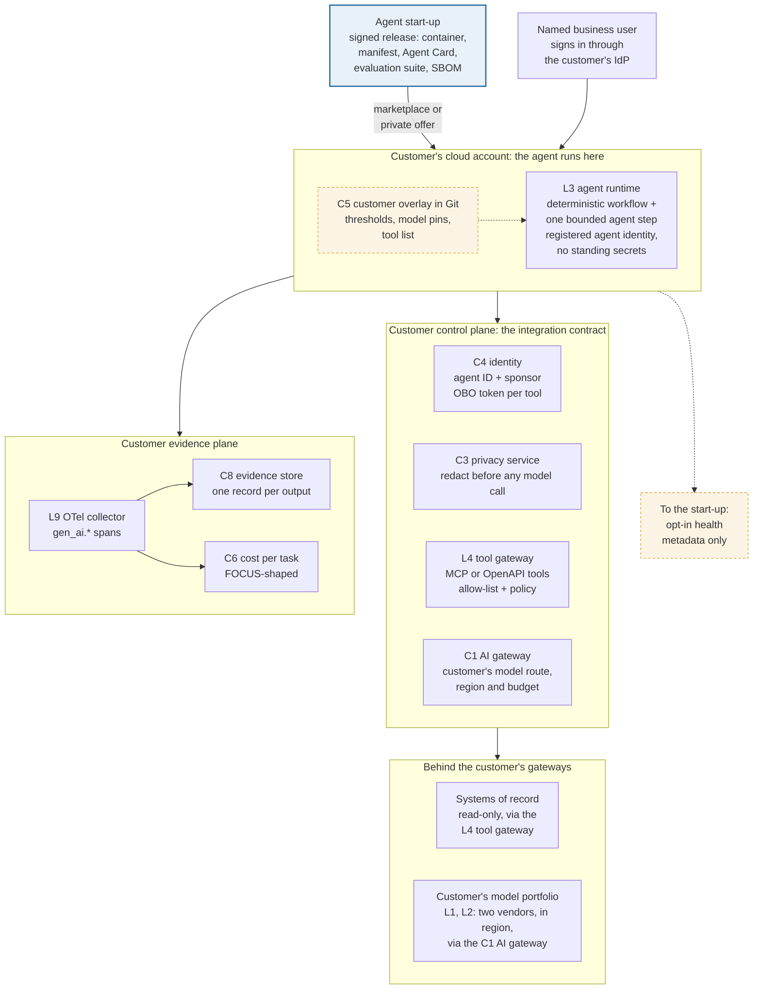

# The agent inside the customer's stack: the integration contract
Caption: The start-up ships a signed release (container, manifest, Agent Card, evaluation suite, SBOM) that runs in the customer's cloud account. Every dependency the agent has is a customer-owned interface: the customer's IdP registers the agent and issues a short-lived on-behalf-of token per tool; model calls go through the customer's AI gateway to the customer's chosen models; tool calls go through the customer's tool gateway under deny-by-default policy; telemetry, evidence and cost land in the customer's stores. The vendor receives only opt-in health metadata.

