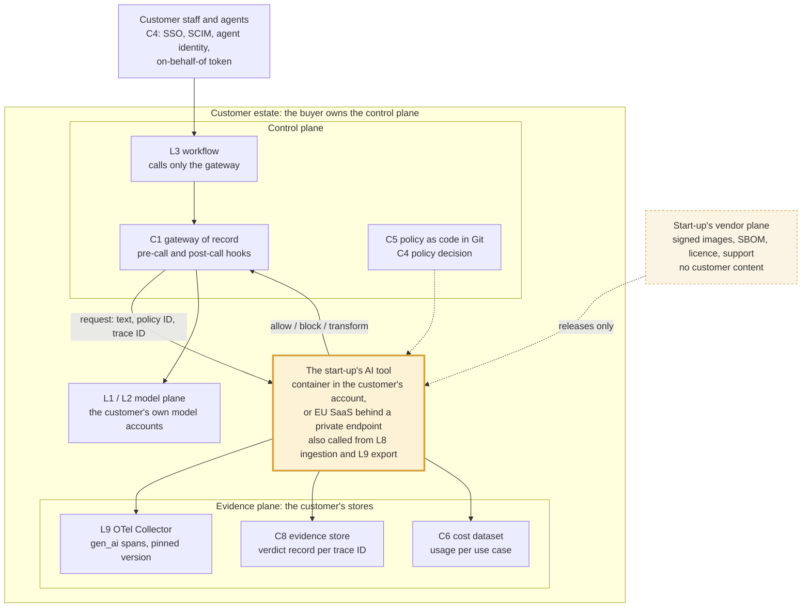

# Where an AI tool plugs into the customer's control plane
Caption: The buyer owns the control plane; the start-up's tool is one call-out inside it. The customer's workflow reaches the tool only through the gateway of record (and from ingestion and trace export), the tool runs in the customer's account or behind a private endpoint, takes its policy from the customer's Git, and writes spans, verdict records and usage to the customer's own collector, evidence store and cost dataset. The vendor plane ships signed releases and never sees customer content.

