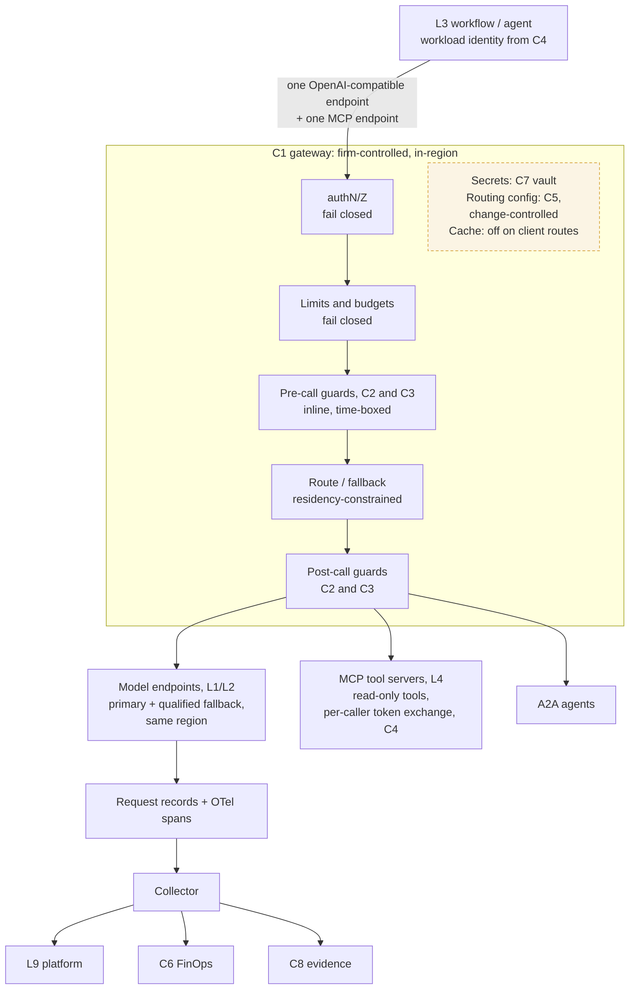

# C1 request path: every LLM, MCP and A2A call through one firm-controlled gateway
Caption: Workflows and agents reach models, tools and other agents only through one in-region gateway that authenticates, enforces limits, guards, routes and records every call.

