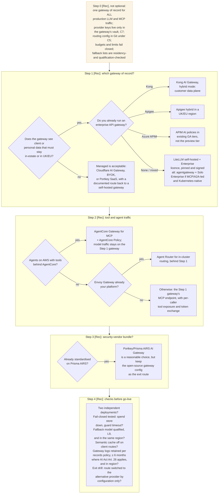

# C1 decision tree: choosing the gateway of record
Caption: Fix one gateway of record first, then pick the product by data residency and existing API gateway, add tool and agent routing, and pass the go-live checks.

