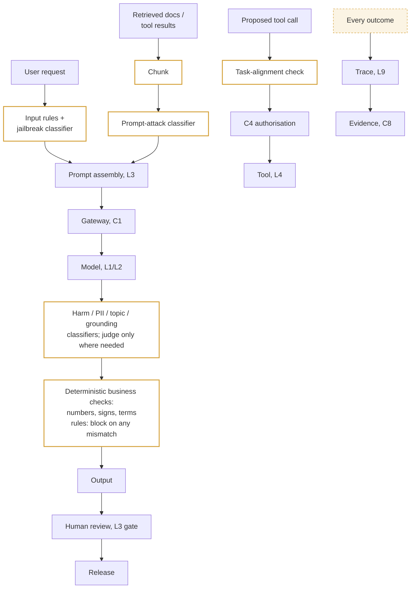

# C2 guardrail placement: checks on input, retrieved content, output and tool calls
Caption: Classifiers screen user input and every retrieved chunk before prompt assembly, classifiers and deterministic business rules screen the output before human review, tool calls pass a task-alignment check and C4 authorisation, and every outcome is traced to evidence.

