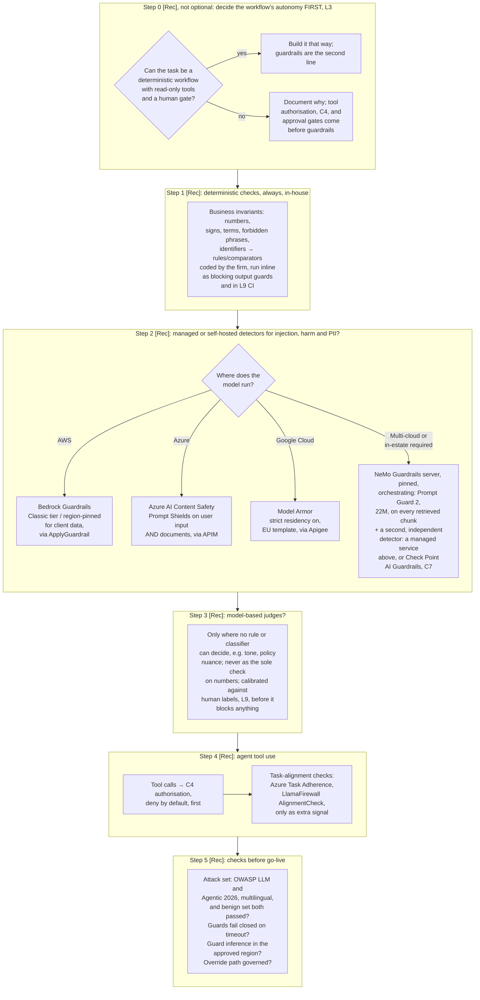

# C2 decision tree: layering guardrails after autonomy and authorisation
Caption: Decide autonomy first, always code deterministic business checks in-house, choose detectors by where the model runs, use model judges only where nothing else can decide, put C4 authorisation ahead of tool-use signals, and pass the go-live checks.

