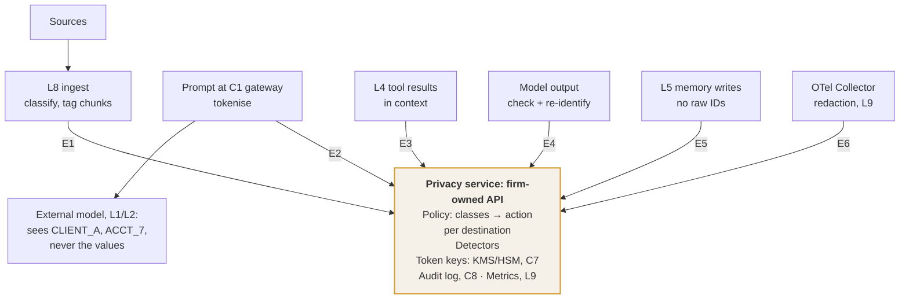

# C3 enforcement points: one firm-owned privacy service called at six points
Caption: Ingestion, prompt, tool results, model output, memory writes and trace export all call the same firm-owned privacy service, so the external model sees only placeholders such as CLIENT_A and ACCT_7, never the values.

