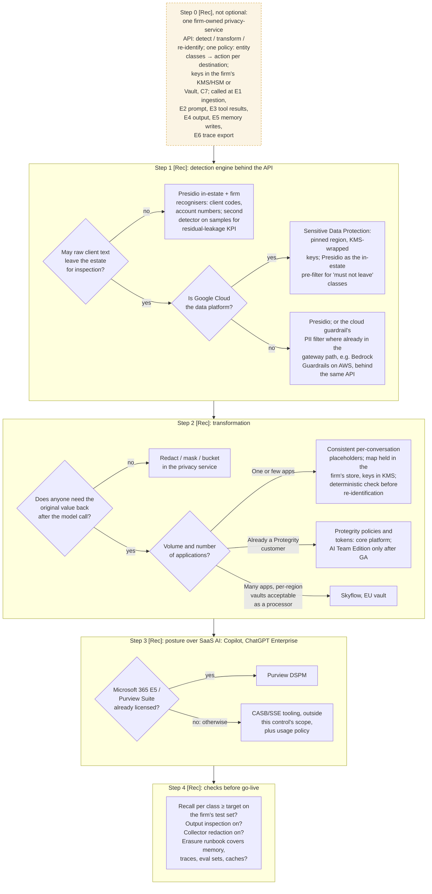

# C3 decision tree: choosing detection and transformation behind one privacy API
Caption: Build one firm-owned privacy-service API first, then choose the detection engine by whether raw text may leave the estate, the transformation by whether values must come back, the posture tool by existing licences, and pass the go-live checks.

