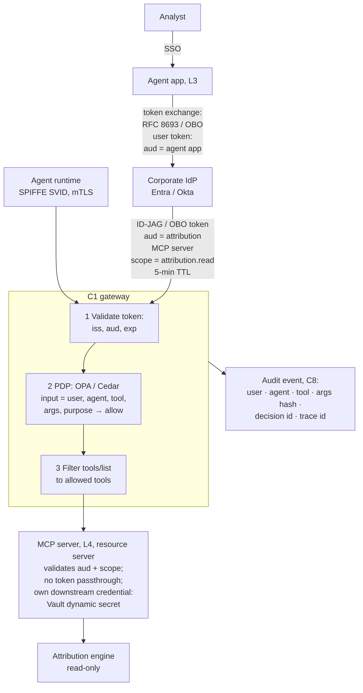

# C4 delegated tool call: from analyst sign-in to audited read-only tool access
Caption: The agent exchanges the analyst's token for a short-lived, narrowly scoped token for one MCP server, the gateway validates it, asks the policy decision point and filters the tool list, and every call leaves an audit event.

