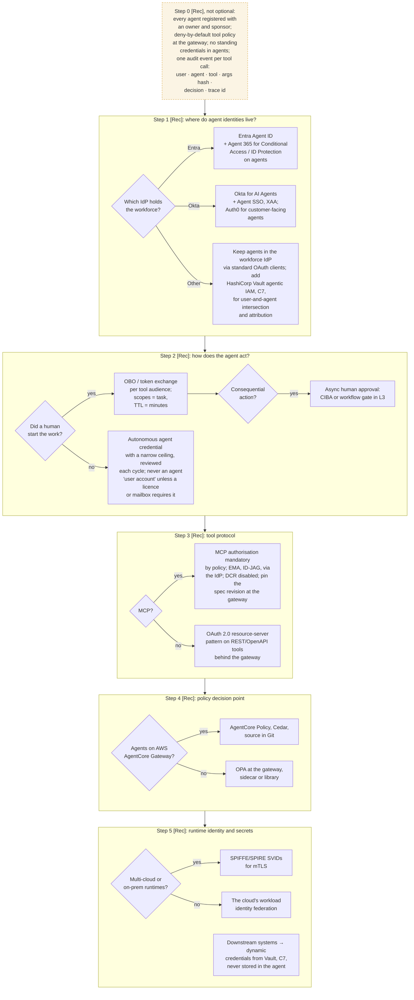

# C4 decision tree: agent identity, delegation, tool protocol and policy
Caption: Register every agent and deny tools by default first, then choose the agent identity home by workforce IdP, the delegation pattern by who started the work, the tool authorisation by protocol, the policy engine by runtime, and the workload identity by estate.

