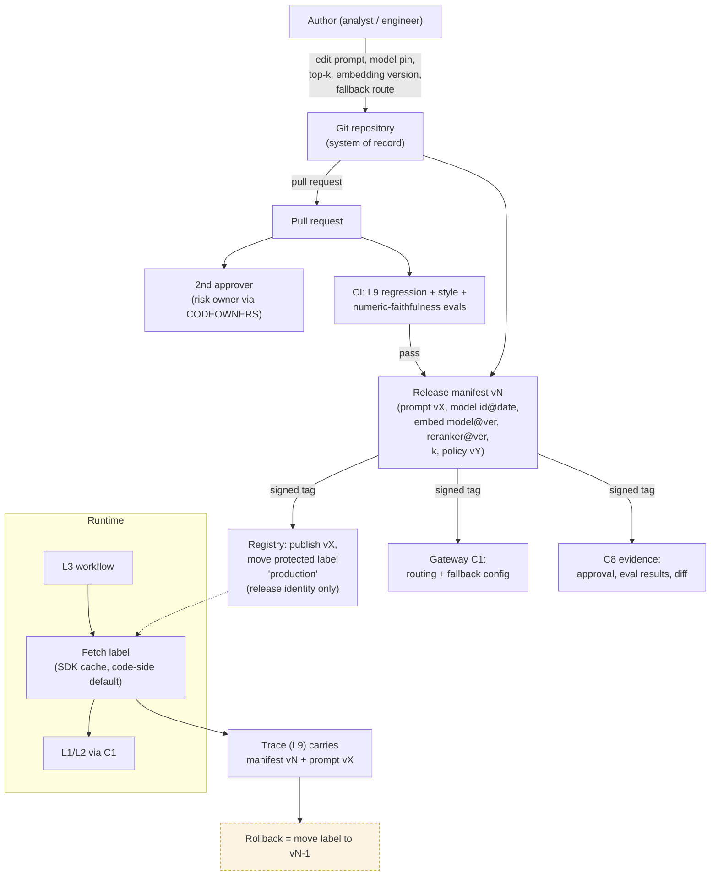

# C5 prompt release: from Git change to runtime and rollback
Caption: Every prompt or configuration change goes through Git, a second approver and the L9 eval gate into one signed release manifest, and rollback is simply moving the label back to the previous version.

