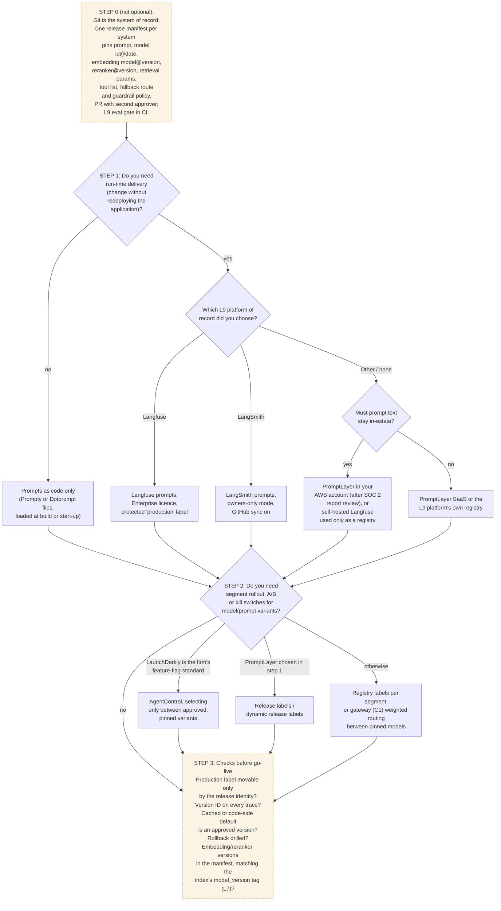

# C5 decision tree: choosing prompt and configuration management
Caption: Git as the system of record and the go-live checks apply whatever is chosen; run-time delivery, the L9 platform of record and the need for segment rollout decide the product.

