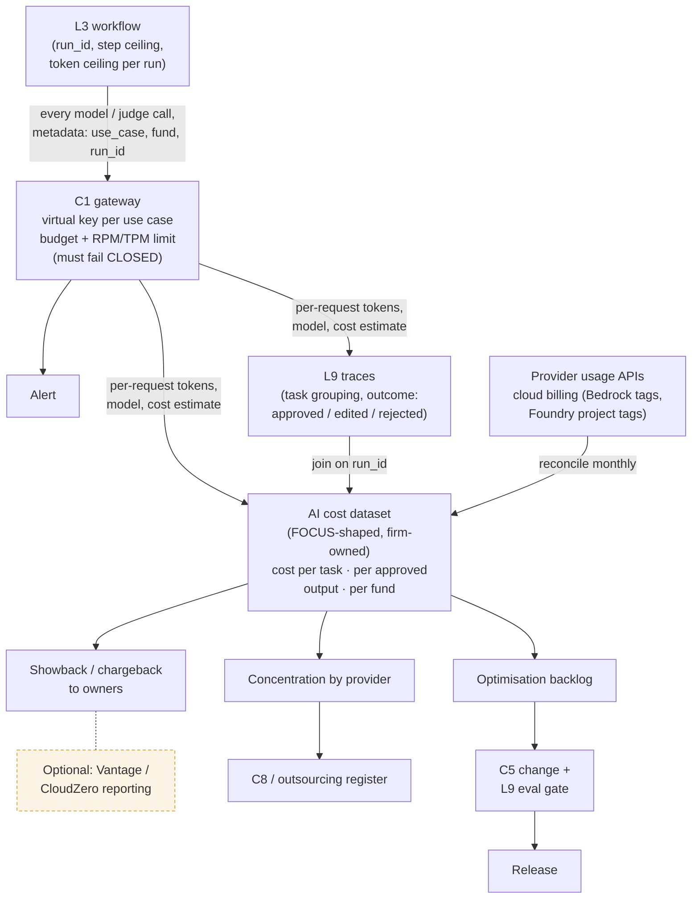

# C6 cost metering: from workflow call to cost per task
Caption: Every model call is metered at the gateway, joined to L9 traces on run_id and reconciled monthly to provider data, so the firm-owned dataset can report cost per task, per approved output and per fund.

