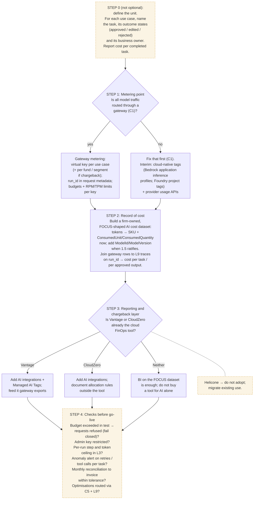

# C6 decision tree: metering, record of cost and chargeback
Caption: Defining the unit and the go-live checks apply whatever is chosen; gateway metering and a firm-owned FOCUS-shaped dataset come before any reporting tool.

