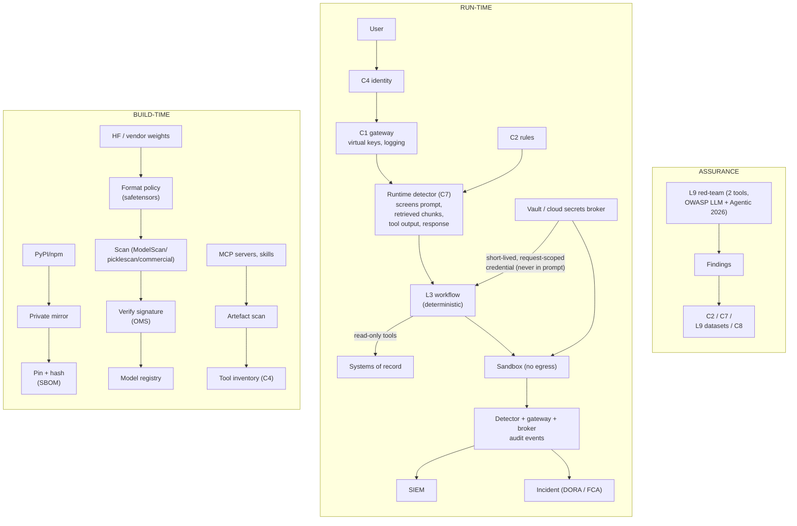

# C7 security controls: build time, run time and assurance
Caption: Supply-chain controls at build time, a detector and credential broker around a deterministic workflow at run time, and red-team findings fed back, with detector, gateway and broker audit events going to the SIEM.

