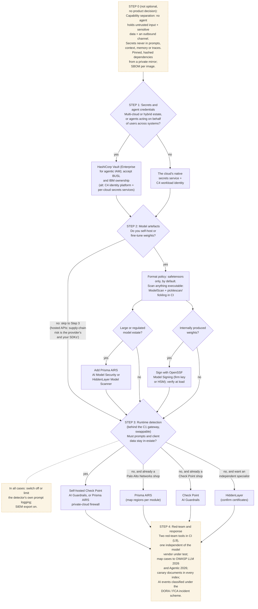

# C7 decision tree: secrets, model artefacts, runtime detection and red-team
Caption: The Step 0 controls apply whatever is chosen; estate shape drives the secrets choice, self-hosting drives model-artefact controls, and residency and existing vendors drive the runtime detector.

