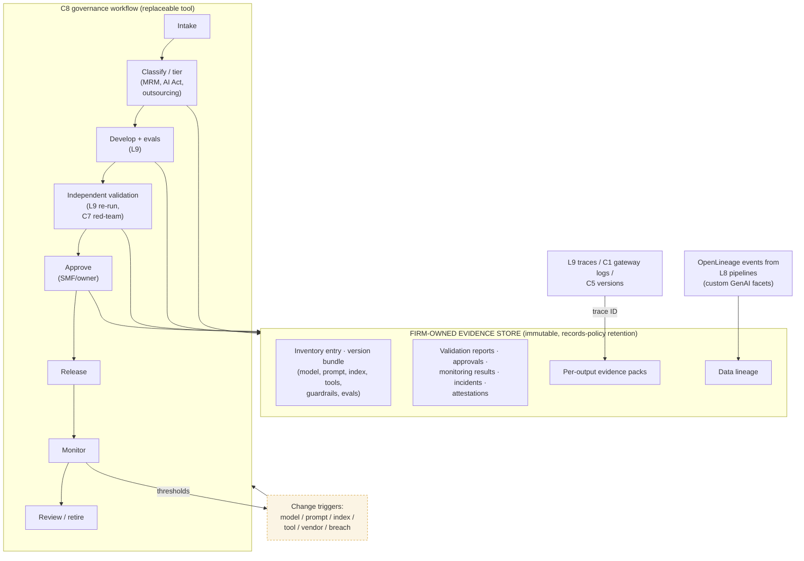

# C8 governance workflow writing to a firm-owned evidence store
Caption: The governance tool runs the lifecycle and is replaceable, while its stages write their evidence to an immutable, firm-owned store that also links per-output evidence packs to traces and data lineage.

