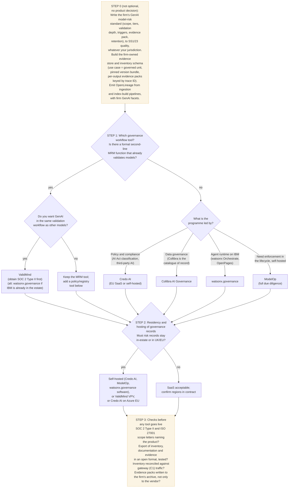

# C8 decision tree: choosing the governance workflow tool
Caption: The model-risk standard, evidence store and lineage come first whatever is chosen; the existence of a second-line MRM function and who leads the programme decide the tool, and residency decides its hosting.

