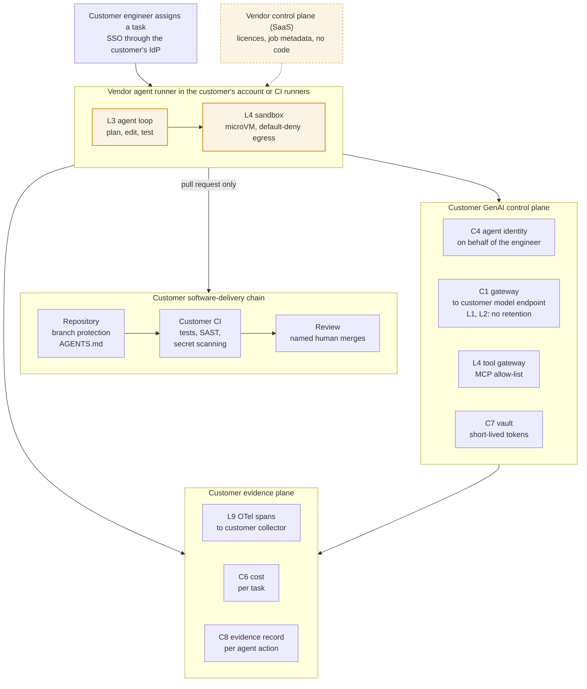

# The agentic-SDLC product inside the customer's stack: the customer's identity, models, tools and evidence; the vendor's agent loop
Caption: The start-up ships an agent runner that executes in the customer's account or on the customer's CI runners, with a thin vendor control plane that never holds source code. Every model call goes through the customer's gateway to the customer's model endpoint, every tool call through the customer's tool gateway, every credential comes from the customer's vault, and the only way the agent changes code is a pull request that the customer's CI checks and a named human merges. Spans, cost per task and an evidence record go to the customer's collector and evidence store.

