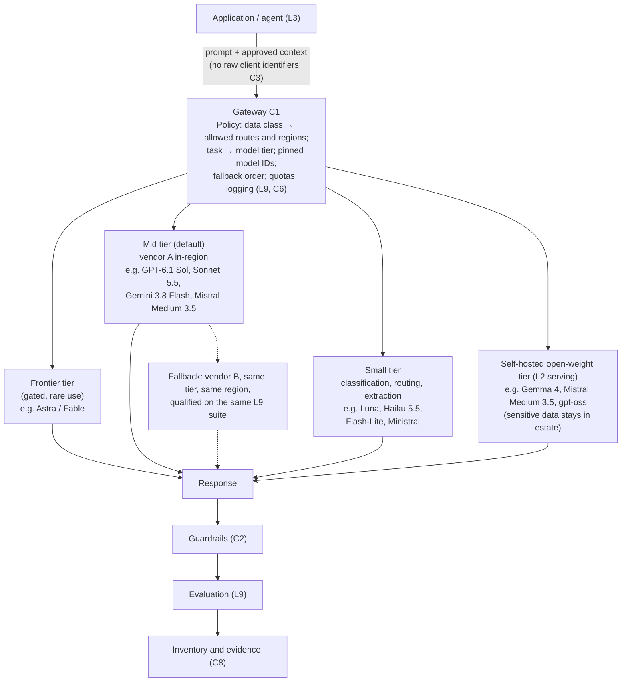

# L1 reference flow: one gateway routing calls across four model tiers
Caption: Every model call passes through the gateway (C1), which picks a tier and an approved route by data class and task, with a qualified same-tier fallback from a second vendor, before the response goes through guardrails, evaluation and evidence.

