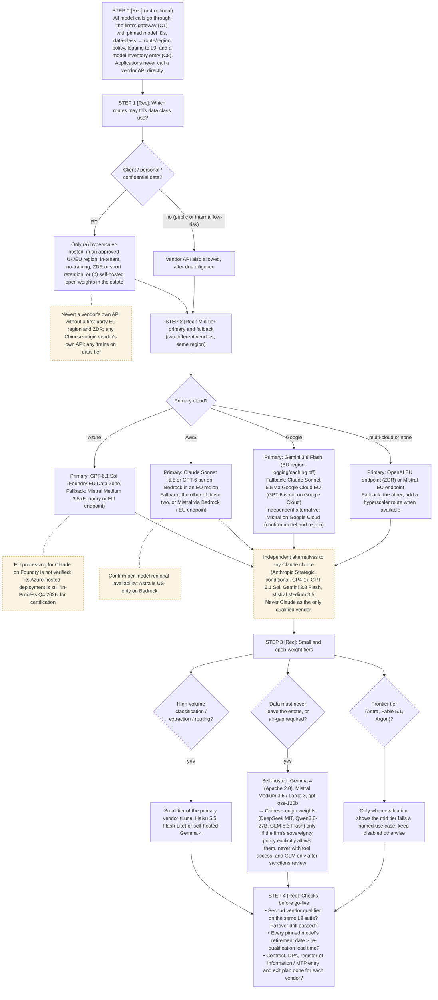

# L1 decision tree: building a model portfolio by route, vendor and tier
Caption: Route every call through the gateway, let the data class decide which routes are allowed, pair a mid-tier primary with a fallback from a different vendor in the same region, add small, open-weight and frontier tiers only for their stated cases, and run the go-live checks.

