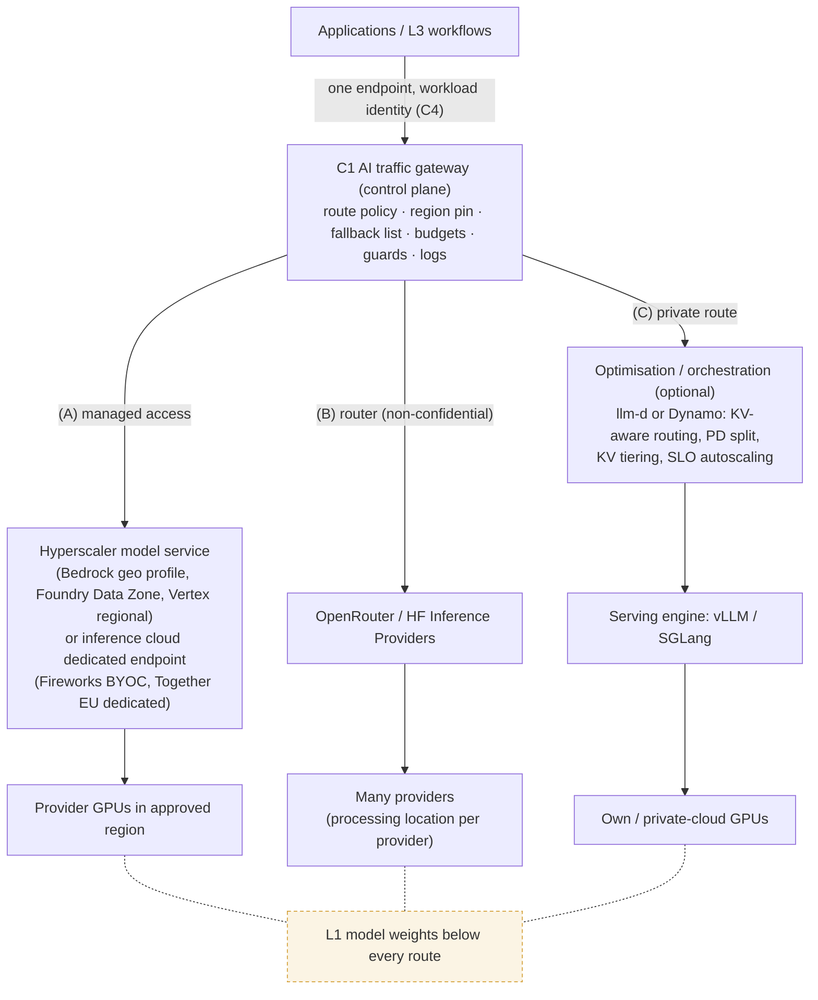

# L2 reference architecture: three serving routes behind one gateway
Caption: Applications reach models through one gateway that governs three routes: managed access, a router for non-confidential traffic, and a private route through an optional optimisation layer and a serving engine to own or private-cloud GPUs, with L1 model weights beneath every route.

