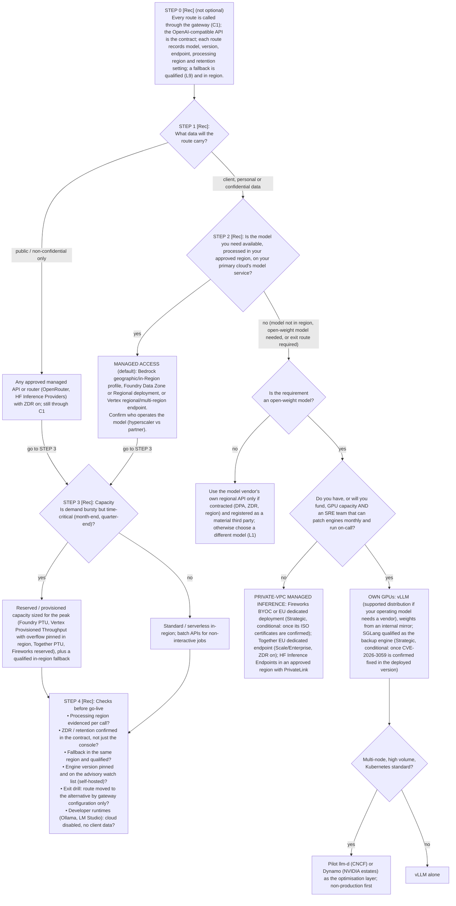

# L2 decision tree: choosing a serving route and capacity model
Caption: Data class decides whether a router may be used, model availability in region decides between managed access and the other routes, GPU and SRE capacity decide between private-VPC managed inference and own GPUs, and demand shape decides reserved versus standard capacity before the go-live checks.

