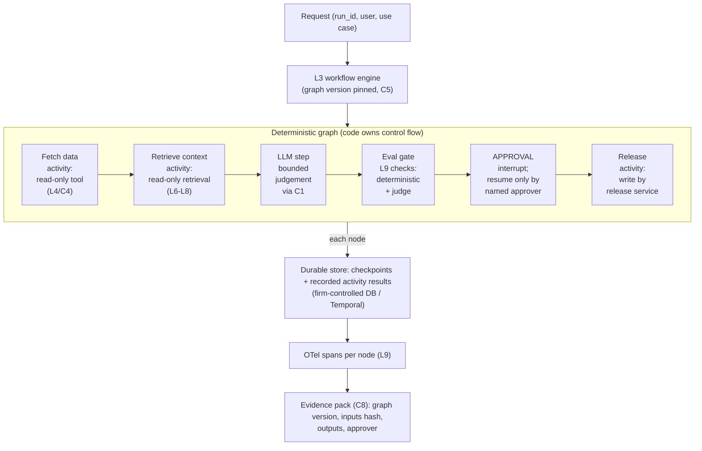

# L3 reference flow: a deterministic workflow with durable state and an approval gate
Caption: Code owns the control flow: the LLM step is one bounded node between read-only activities and an evaluation gate, a named approver must resume the run before release, and every node is checkpointed, traced and written to an evidence pack.

