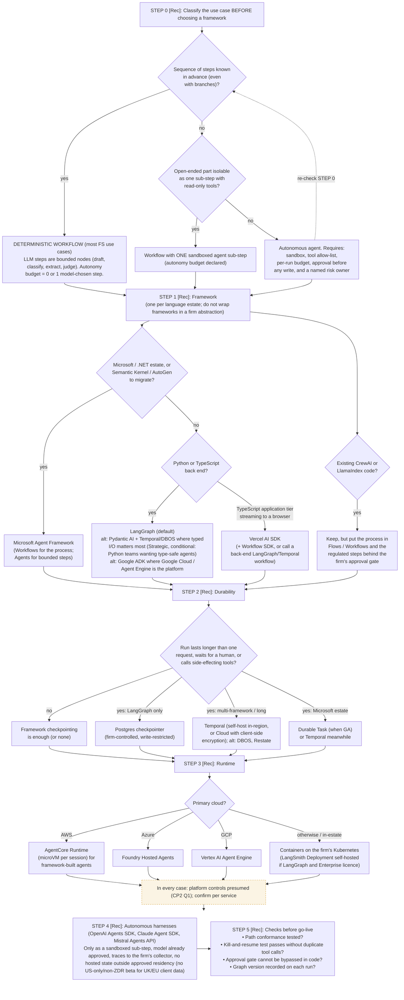

# L3 decision tree: classifying the use case, then choosing framework, durability and runtime
Caption: Decide first whether the use case is a deterministic workflow, then pick one framework per language estate, add durable state when runs outlive a request, run agents on the primary cloud's runtime, confine autonomous harnesses to sandboxed sub-steps, and pass the go-live checks.

