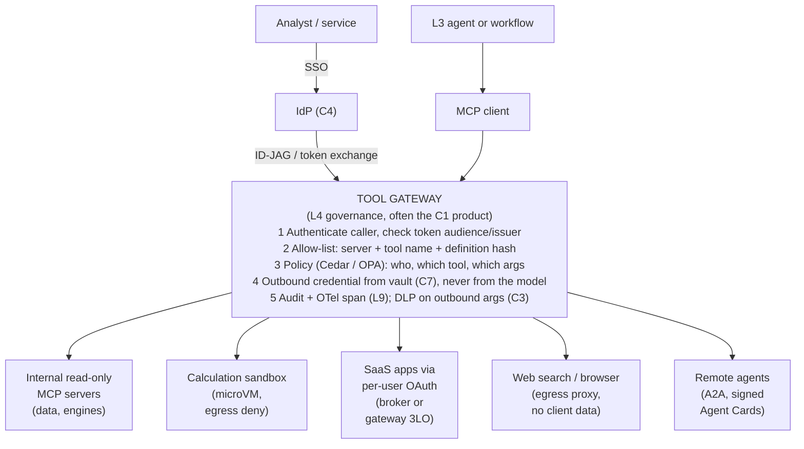

# L4 reference flow: agents reach every tool through one governed tool gateway
Caption: The user's identity reaches the tool gateway by token exchange, and the gateway authenticates the caller, checks the allow-list and policy, supplies outbound credentials from the vault rather than the model, and audits each call before it reaches internal servers, sandboxes, SaaS apps, the web or remote agents.

