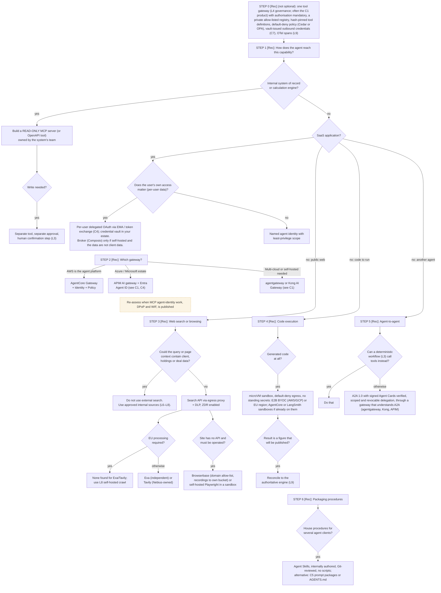

# L4 decision tree: connecting agents to tools, SaaS, the web, code and other agents
Caption: Every capability goes through one default-deny tool gateway; internal systems get read-only tools, SaaS gets delegated or least-privilege identity, and web search, code execution and agent-to-agent calls each have their own guarded route.

