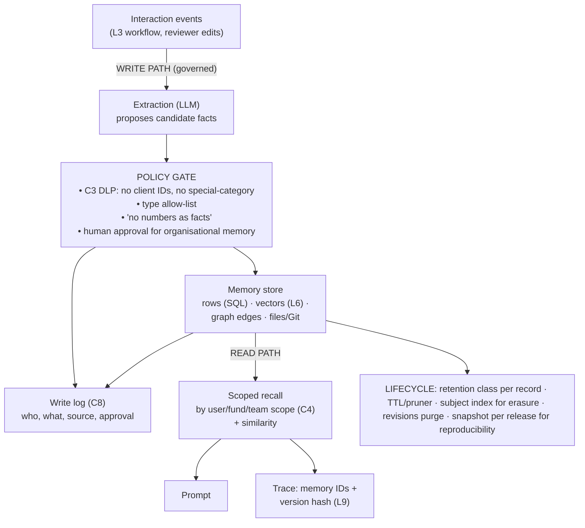

# L5 reference flow: governed write and scoped read paths for agent memory
Caption: Candidate memories must pass a policy gate before they reach the memory store and every write is logged, recall is scoped by user, fund or team and traced, and every record carries a retention class and lifecycle controls for erasure and reproducibility.

