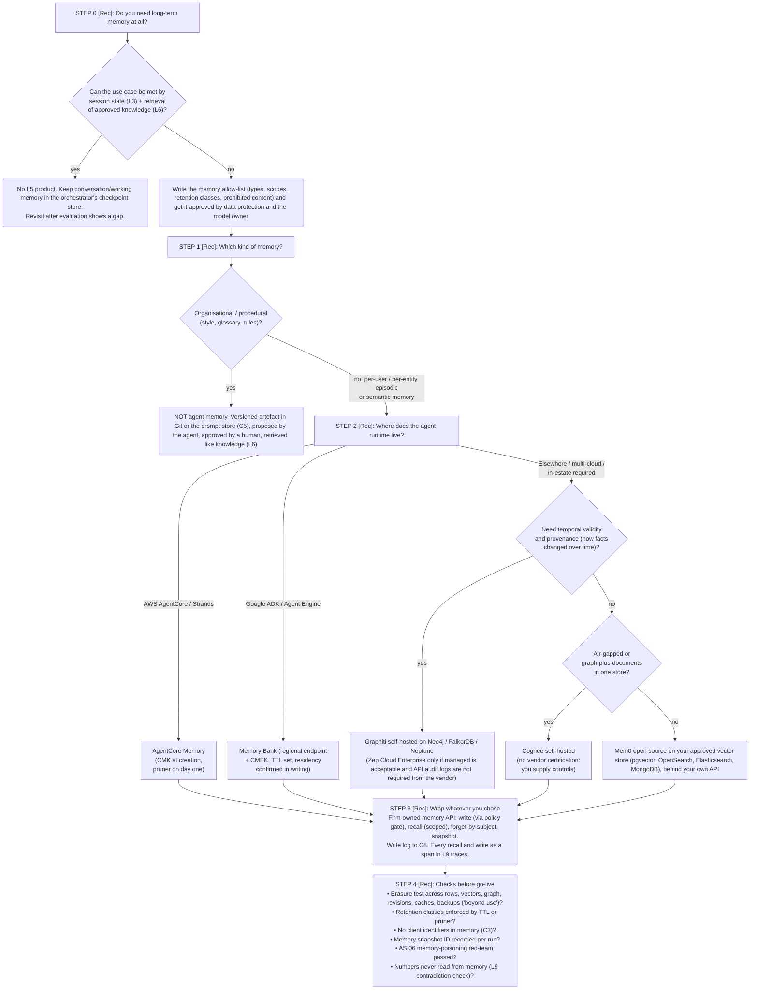

# L5 decision tree: whether to add long-term memory and which product to use
Caption: Add an L5 product only when session state and approved knowledge retrieval are not enough, keep organisational memory as approved versioned artefacts, choose the memory product by where the agent runtime lives, wrap it in a firm-owned API and pass the go-live checks.

