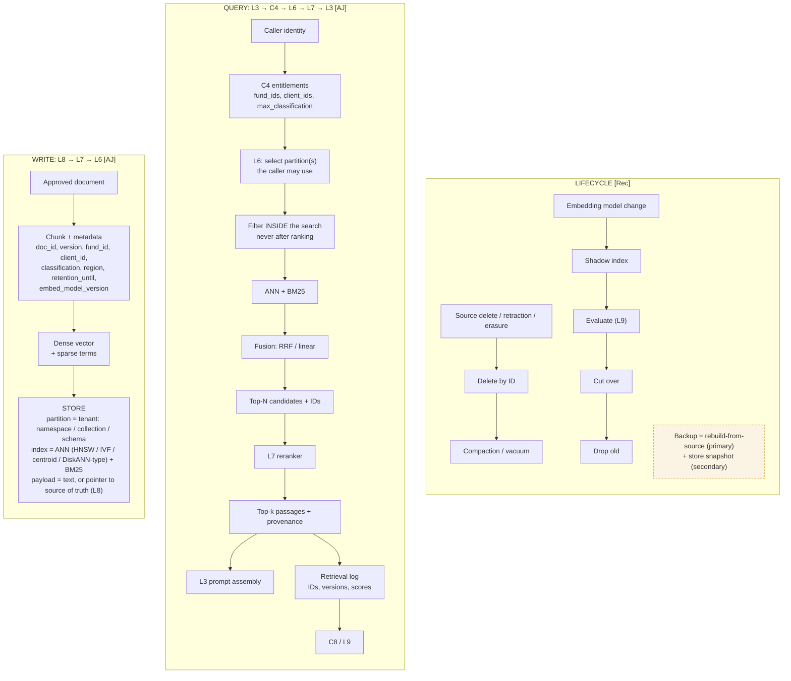

# L6 vector store: write path, query path and lifecycle
Caption: Content enters the store tagged with tenant and version metadata, every query is filtered by C4 entitlements inside the search rather than after ranking, and deletion, embedding model change and backup each follow a set lifecycle path.

