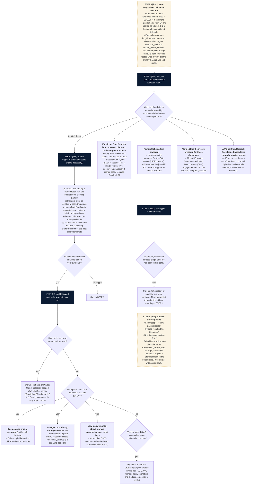

# L6 decision tree: whether a dedicated vector database is needed, and which
Caption: Start from the database or search platform you already operate, move to a dedicated engine only when a load test on your own data evidences a trigger, then choose that engine by where it must run and check it before go-live.

