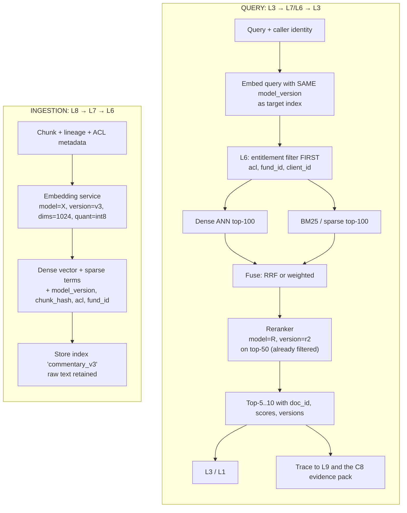

# L7 embedding and reranking: one pinned model configuration on both paths
Caption: Ingestion and query use the same embedding model version, entitlement filtering runs in L6 before the dense and lexical lists are fused and reranked, and the top results return with doc IDs, scores and versions while a trace goes to L9 and the C8 evidence pack.

