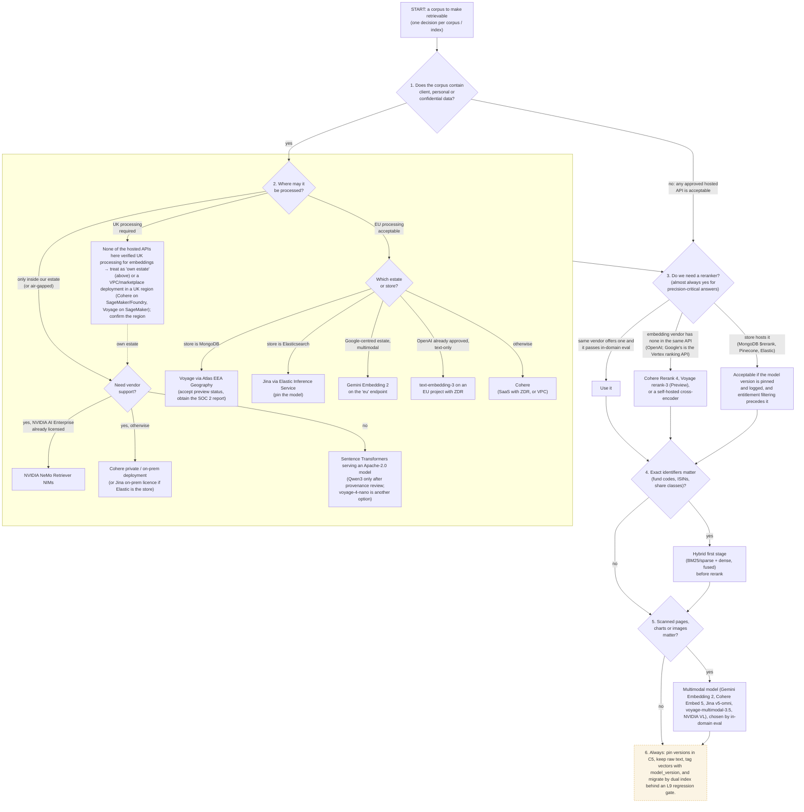

# L7 decision tree: choosing embedding and reranking models for a corpus
Caption: Data sensitivity and permitted processing location decide the embedding route first, then reranking, hybrid retrieval and multimodal needs are settled, and every choice is version-pinned and migrated behind an L9 regression gate.

