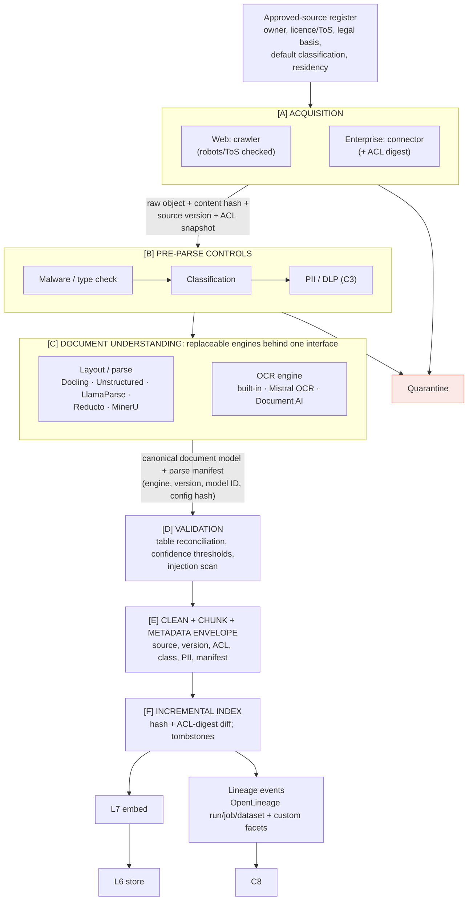

# L8 ingestion: controls before and after replaceable parsing engines
Caption: Every source starts on the approved-source register, passes acquisition and pre-parse controls (with a quarantine exit) before swappable parsing and OCR engines run, and leaves validated, enveloped chunks for incremental indexing with lineage sent to C8.

