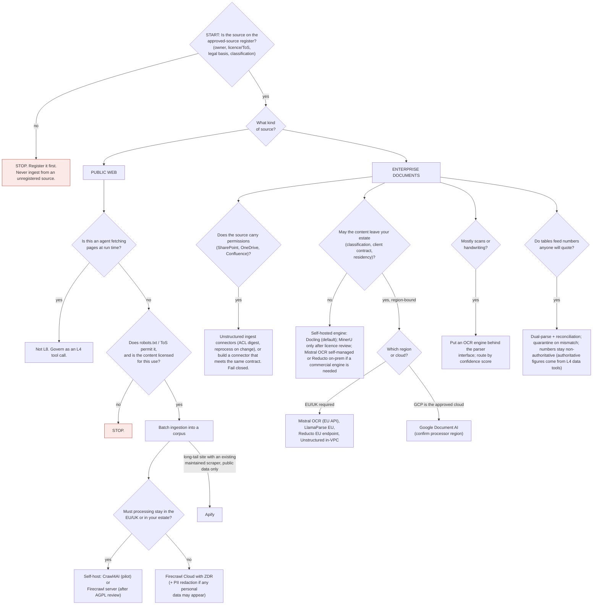

# L8 decision tree: ingesting public web and enterprise documents
Caption: Nothing is ingested from an unregistered source; public-web ingestion turns on permission, licence and processing location, while enterprise documents are routed by permissions, where content may be processed, scans and quotable tables.

