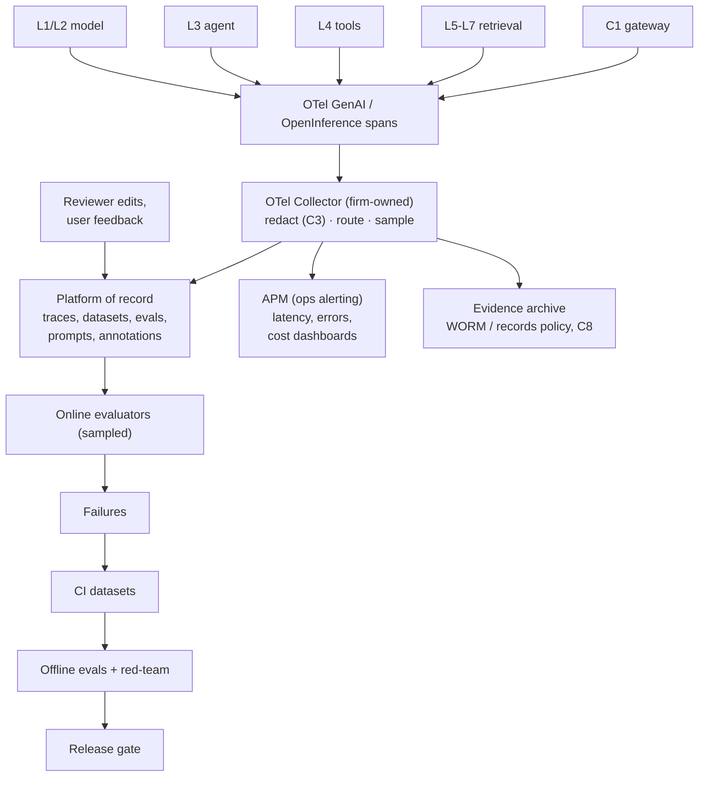

# L9 observability: one firm-owned telemetry pipeline and a closed evaluation loop
Caption: The model, agent, tool and retrieval layers and the C1 gateway emit OTel GenAI or OpenInference spans into a firm-owned OTel Collector that redacts, routes and samples them to a platform of record, APM and an evidence archive, while sampled online evaluation turns failures into CI datasets for offline evals and red-teaming ahead of the release gate.

