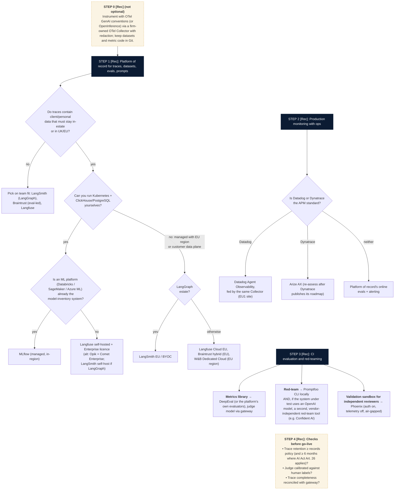

# L9 decision tree: observability platform of record, monitoring and evaluation tooling
Caption: After instrumenting through a firm-owned OTel Collector, the platform of record is chosen by data residency, self-hosting capacity and existing ML platform, production monitoring follows the APM standard, CI evaluation and red-teaming are added, and go-live checks close the selection.

