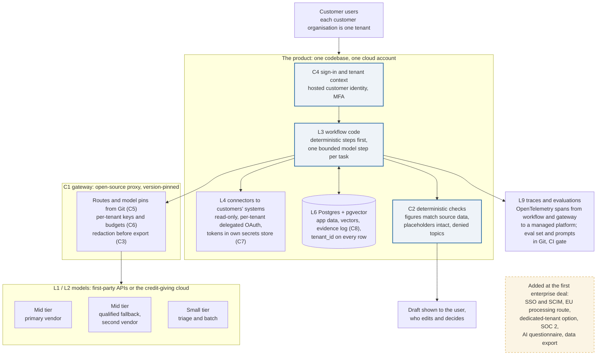

# Start-up architecture: one thin control plane, built in the first fortnight
Caption: A small team runs one product on one cloud account and one Postgres database. Every model call passes through a pinned gateway that holds the routes, per-tenant budgets and model pins. The model writes only inside deterministic workflow code, and the code checks every output before a person sees it. Traces and evaluations leave from day one through OpenTelemetry. The dashed box holds what the first enterprise customer will ask for, which is added then and not before.

