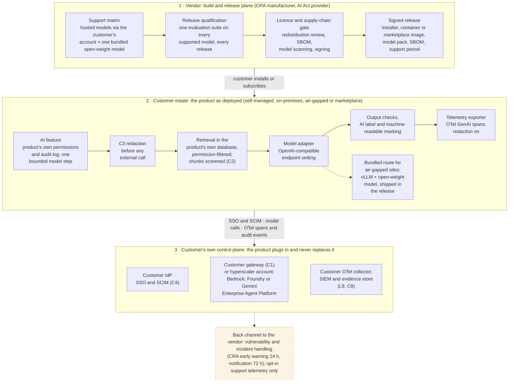

# SW architecture: the vendor's release plane and the product inside the customer's estate
Caption: The vendor qualifies every supported model, gates every redistributed component and ships a signed release; in the customer's estate the AI feature uses the product's own permissions, calls the model through the customer's gateway or cloud account (or a bundled open-weight model on air-gapped sites), and sends telemetry and audit events to the customer's own tools.

