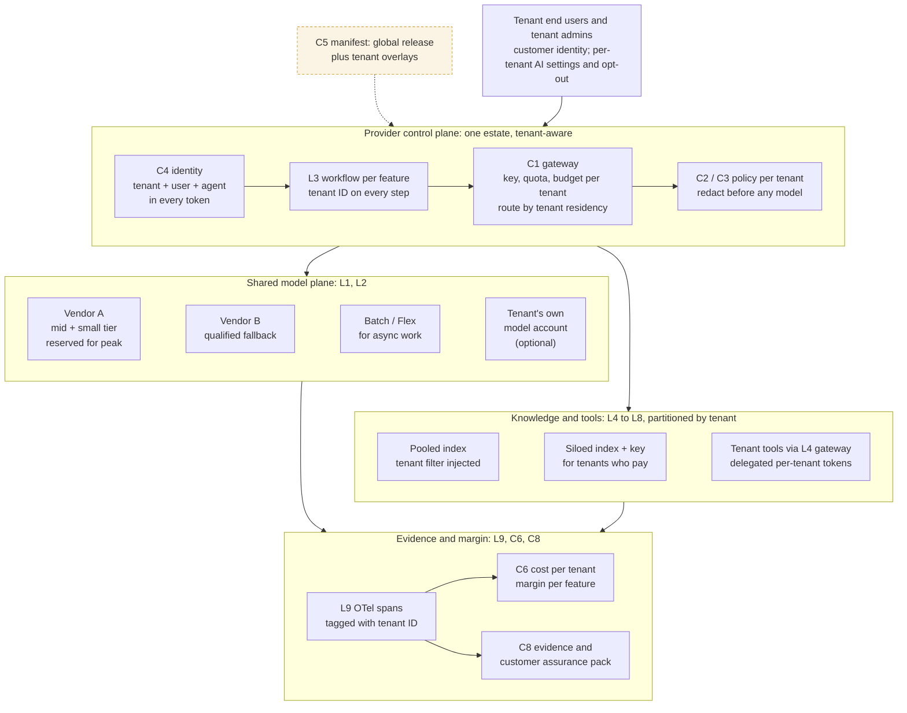

# The technology service provider's GenAI architecture: one estate, every call tenant-aware
Caption: The provider runs one control plane for all tenants: tenant identity travels in every token, the gateway meters, limits and routes per tenant, the knowledge plane is partitioned by tenant (pooled by default, siloed for tenants who pay for it), and every span carries the tenant ID so cost, margin and customer evidence can be reported per tenant.

