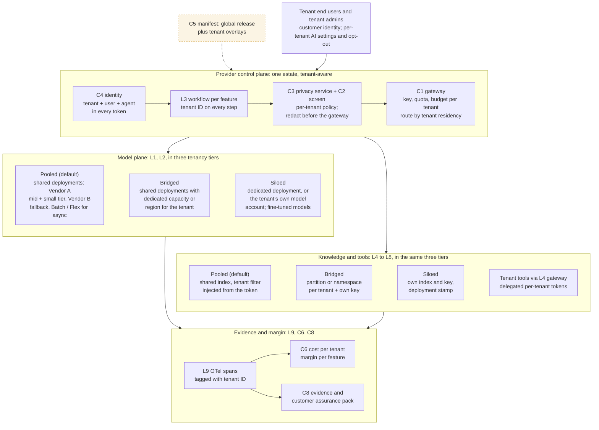

# The technology service provider's GenAI architecture: one estate, every call tenant-aware
Caption: The provider runs one control plane for all tenants: tenant identity travels in every token, the gateway meters, limits and routes per tenant, the privacy service redacts each request before the gateway, the model and knowledge planes are partitioned by tenant in three tiers (pooled by default, bridged for regulated or residency-bound tenants, siloed for tenants who pay for single-tenancy), and every span carries the tenant ID so cost, margin and customer evidence can be reported per tenant.

